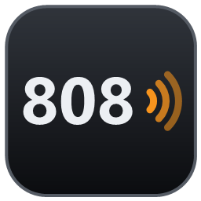
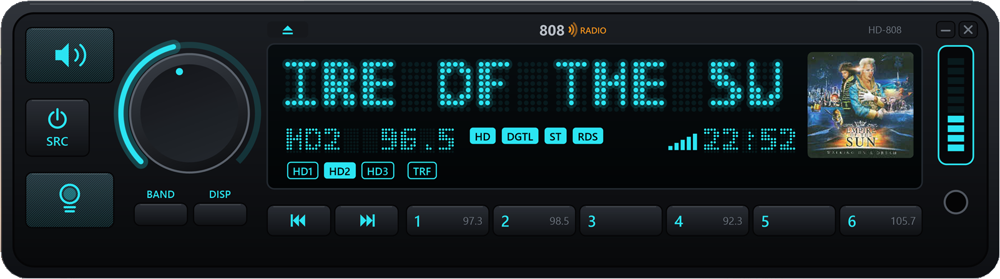
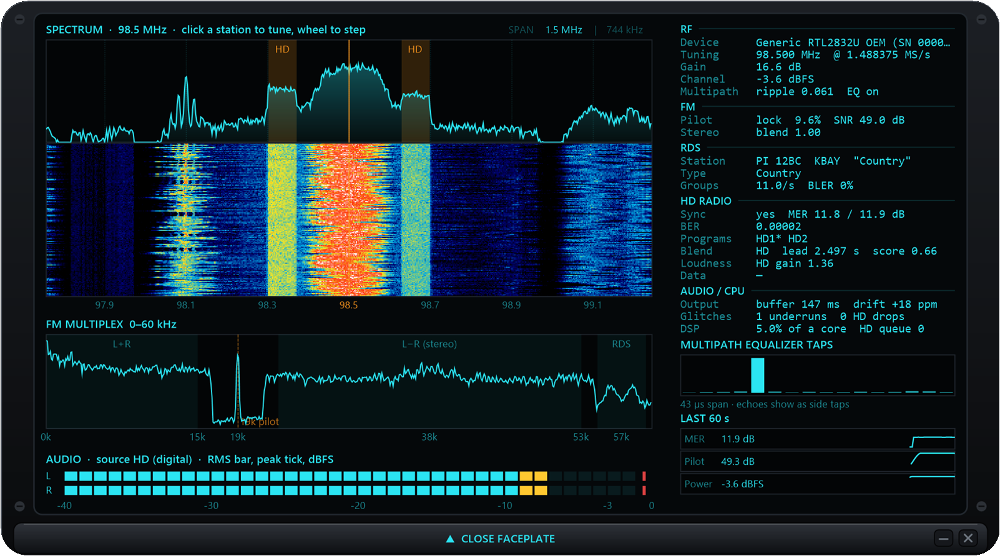

<p align="center"></p>

# 808 Radio

**An FM + HD Radio receiver for Windows and RTL-SDR dongles, styled as a car stereo.**



808 Radio turns a $30 RTL-SDR dongle into a proper radio: FM stereo with RDS, and **HD Radio** (NRSC-5) with album
art, multicast channels (HD1–HD8), weather and traffic maps, blended with the analog signal like a real HD receiver.
It finds the best gain for each station by itself and corrects the dongle's frequency error automatically.

Flip the faceplate down (the ▲ key) and there's an instrument panel behind it: spectrum and waterfall with
click-to-tune, the FM multiplex, and live signal statistics.



## Download

**[Latest release](https://github.com/mattackerman808/808-Radio/releases/latest)**: unzip `808Radio-vX.Y.Z-win-x64.zip`
anywhere and run `808Radio.exe`. It's self-contained: no installer, no .NET install.

## Hardware

- **An RTL2832U-based dongle**: RTL-SDR Blog V3 (tested) or V4, NooElec NESDR, or generic R820T/R820T2/R828D sticks.
  808 Radio uses the standard [osmocom librtlsdr](https://gitea.osmocom.org/sdr/rtl-sdr) driver.
- **The WinUSB driver**, installed once with [Zadig](https://zadig.akeo.ie/): *Options → List All Devices*, choose
  *Bulk-In, Interface (Interface 0)*, select *WinUSB*, *Replace Driver*. If SDR# or another SDR program already works
  with the dongle, this is done.
- An FM antenna. Only one program can use the dongle at a time, so close SDR# etc. first.
- Windows 10 or 11, x64.

HD Radio is broadcast in North America (and a few other places); the analog radio, RDS and the instrument panel work
anywhere, though the tuning grid, de-emphasis and program types are US defaults for now.

## Using it

| | |
|---|---|
| **Volume** | drag or scroll the knob; click it to mute (or ↑/↓, M) |
| **Tune** | scroll over the display, or ←/→ (one channel, 200 kHz) |
| **Seek** | the ⏮ ⏭ keys, Ctrl+←/→, or media keys |
| **Presets 1–6** | click to tune, hold (or right-click, or Ctrl+1–6) to save |
| **SRC** | HD (automatic blend) or analog FM only (A) |
| **BAND** | next HD program: HD1, HD2 … (H) |
| **DISP** | now playing / station name / frequency (D) |
| **Bulb key** | illumination color (C): cyan, amber, green, red, blue, white |
| **▲** | flip the faceplate down to the instrument panel (O) |
| **Right-click** | gain, frequency correction, antenna power (bias-tee), always on top, … |

Drag the faceplate to move it; drag its edges to resize. The display shows **HD** (outlined: HD found; filled: playing
HD), **DGTL** (you're hearing the digital audio), **ST** (stereo), **RDS**, and **P1–P6** when on a preset. The slot on
the right is the signal-quality meter (HD MER when HD is locked); it turns red with **OVL** if the dongle overloads.

In the instrument panel, click a station in the spectrum or waterfall to tune it (the view slides it to the center),
and scroll to step. **SPAN** switches between the dongle's full 1.5 MHz and the 744 kHz HD baseband.

Settings are saved in `%APPDATA%\808Radio\settings.json`; errors go to `808Radio.log` in the same folder.

## Features

- **FM**: stereo with a pilot-SNR-based blend (less hiss on weak stations), 75 µs de-emphasis, and a **multipath
  equalizer**: FM has a constant envelope, so a blind constant-modulus equalizer can learn and cancel reflections.
- **RDS / RBDS**: call sign (decoded from the PI code), station name, RadioText, program type.
- **HD Radio** via [nrsc5](https://github.com/theori-io/nrsc5): HD1–HD8, station name and slogan, song and artist,
  album art and station logos, weather and traffic maps, emergency alerts.
- **HD/analog blending**: HD audio is time-aligned to the analog (measured by cross-correlating loudness envelopes),
  crossfaded to analog just before dropouts, loudness-matched, and held off on weak signals until it's stable.
- **Automatic gain**: the RTL's best gain is just below where its 8-bit ADC starts clipping, which varies by station
  and location. 808 Radio climbs to that edge on every tune, backs off for headroom, then keeps fine-tuning on HD MER
  (or stereo pilot SNR), with guards that drop the gain the moment the front end overloads.
- **Automatic frequency correction**: a broadcaster's carrier is crystal-accurate, so the FM discriminator's average
  is the dongle's own tuning error; corrections of 1.5 ppm or more are applied and saved.

## How it works

Every stage runs at an integer fraction of the dongle's clock, so the analog audio and the HD baseband share one
timeline:

| Stage | Rate (S/s) | |
|---|---|---|
| Dongle | 1,488,375 | 2 × nrsc5's native rate |
| Halfband ÷2 | 744,187.5 | HD baseband → nrsc5 |
| Channel filter ÷2 | 372,094 | ±100 kHz, rejects the HD sidebands; multipath equalizer |
| FM discriminator | 372,094 | → multiplex (MPX) |
| MPX filter ÷2 | 186,047 | 0–60 kHz: mono, 19 kHz pilot, stereo, RDS |
| Stereo decoder ÷4 | 46,512 | pilot PLL, L−R demodulation, blend, de-emphasis |
| Resampler | 48,000 | trimmed by a PI loop on the output buffer to absorb dongle/soundcard clock drift |

Audio goes out through WASAPI and follows the Windows default device. nrsc5's HD stereo comes out mirrored relative to
the analog on every station tested (likely a parametric-stereo sign convention in its HDC decoder), so it's swapped
back.

## Building from source

Requirements (all free): the [.NET 9 SDK](https://dotnet.microsoft.com/download) (`winget install
Microsoft.DotNet.SDK.9`) and [MSYS2](https://www.msys2.org/) (`winget install MSYS2.MSYS2`) for the native libraries.

```
git clone --recursive https://github.com/mattackerman808/808-Radio.git
cd 808-Radio
powershell -ExecutionPolicy Bypass -File build.ps1
```

`build.ps1` installs the MSYS2 packages it needs, builds `rtlsdr.dll`, `libusb-1.0.dll` and `libnrsc5.dll`
(first time: several minutes), publishes the self-contained app, and writes `dist\808Radio-v<version>-win-x64.zip`.
`-Clean` rebuilds the native libraries. Use a path without spaces.

For development, `dotnet build src/Radio808.App -c Release` after the native libraries exist. `808Radio.exe --replay
<folder>` plays recordings (`97.3.cu8`, `st98.5.cu8`, …: 8-bit I/Q at 1,488,375 S/s) instead of a dongle.

## Tools

`tools/Radio808.Tools` (`radio808-tools.exe`), for testing and measurement:

| Command | |
|---|---|
| `devices`, `probe <MHz>` | list dongles; stream and report rate and level |
| `capture <MHz> <s> <out.cu8> [gain]` | record I/Q (nrsc5's cu8 format) |
| `spectrum <file>`, `scan [gain]`, `ripplescan [gain]` | spectrum of a recording; band scans |
| `fm <in.cu8> <out.wav>`, `hd <in.cu8> <out.wav>` | offline decoding with stats (HD: alignment, blend, L/R check) |
| `play <MHz> [gain\|auto]` | the radio in a console, with live stats |
| `selftest [CNR] [echo dB] [echo µs]` | synthetic stereo broadcast through the receiver |
| `gainsweep`, `gaintest`, `ppmtest`, `ctlstress` | gain, frequency-correction and control-path tests |

## Credits

- [nrsc5](https://github.com/theori-io/nrsc5), with FAAD2 and FFTW: HD Radio decoding
- [librtlsdr](https://gitea.osmocom.org/sdr/rtl-sdr) (osmocom) and [libusb](https://libusb.info/): dongle access
- [NAudio](https://github.com/naudio/NAudio): WASAPI output
- Sister project: [808 HD](https://github.com/mattackerman808/808-HD), an HD Radio plugin for SDR#

## License

GPL-3.0-or-later (see `LICENSE`); third-party components are listed in `THIRD_PARTY_NOTICES.md`. HD Radio is a
trademark of Xperi Inc.; 808 Radio is not affiliated with Xperi, RTL-SDR Blog or Osmocom. The 808 Radio mark is
original artwork.
